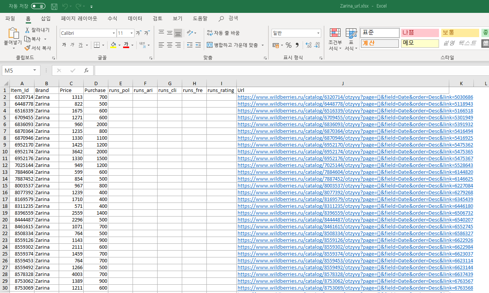

# crawling-review
크롤링 - 동적인 자바스크립트 사이트

## 개요
### 1.
https://www.wildberries.ru/catalog/5966627/otzyvy?page={}&field=Date&order=Desc&link=4773432 의 사이트에서 리뷰를 크롤링하려고 한다. 
하지만 밑의 그림에서 볼 수 있다시피, '더 많은 리뷰보기'라는 버튼을 눌러야만 모든 댓글들이 조회가 된다. 
'더 많은 리뷰보기'를 누르지 않은 상태에서 크롤링을 하게 되면, 화면에 보이는 리뷰들에 대해서만 크롤링이 된다.


이를 해결하기 위해 puppeteer 패키지를 사용해서 '더 많은 리뷰보기'를 클릭해서 모든 리뷰를 조회한 뒤에 크롤링하는 식으로 코드를 짰다. 


### 2. 


Zarina_url.xlsx 파일에 있는 url들의 페이지에 대해서 전부 크롤링을 시도하려고 한다. 
xlsx 패키지를 사용해서 xlsx 파일을 json 형태로 변환해서 배열로 출력하도록 만든다. 
그런 뒤에 for문을 이용해 각 페이지마다 크롤링을 한다.


## 실행 방법
```
$ npm install
```

```
$ node review.js
```
